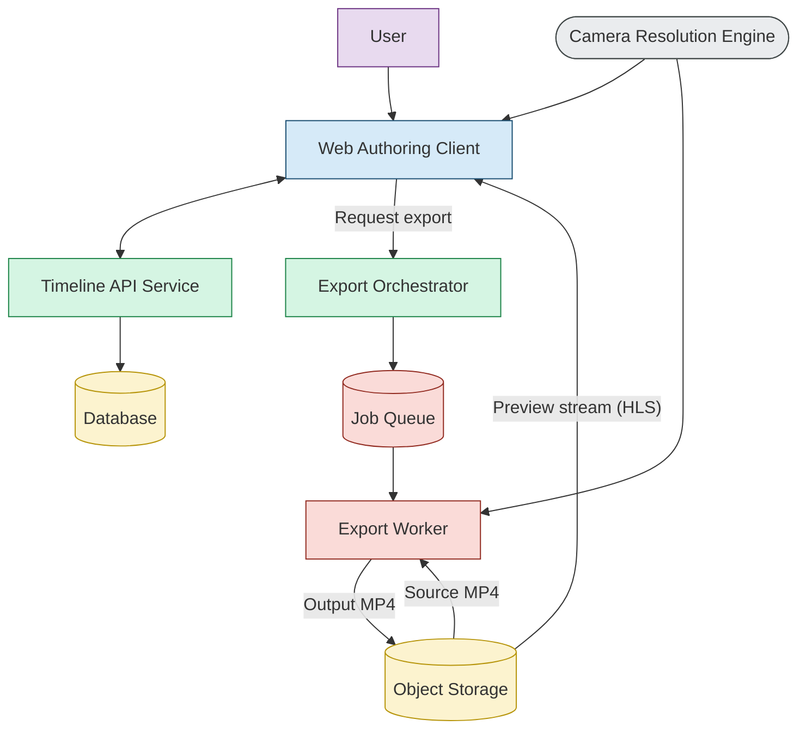

## 1. Problem Context

Modern sports and analytics workflows require extracting multiple focused views (player follow, tactical wide, highlights) from a single high-resolution video without re-recording or destructive editing. Traditional video editors are too complex, while simple players lack precision, repeatability, and auditability.

This system introduces a **virtual camera** abstraction that allows users to _author camera intent_ over time and export deterministic video outputs.

## 2. Goals
- **Non-destructive editing:** Source video is never modified.
- **Sparse intent persistence:** Store only keyframes + segment transitions (cut/smooth), not continuous gestures.
- **Deterministic playback and export:** Same timeline + same inputs ⇒ same output MP4.
- **Preview ≡ Export geometry:** Preview uses the same camera math as export, via shared logic.
## 3. Operating Modes

Video is operated in 3 modes
1. **Authoring (Edit)**
	- Gestures update live preview state only and are not persisted
	- Keyframes are captured at gesture boundaries
2. **Preview**
	- Read only visualization of the edited video
3. **Export**
	- Background process to create final mp4 video
	- Frame by frame resolution of the viewport. 
	- Crop + scale + encode via ffmpeg.
	
- In all the above modes, the system derives the viewport at every frame based on the previous persisted keyframe and segment transition type. This resolution logic is implemented in the **Camera Resolution Engine (CRE)**, a shared library reused consistently across Authoring, Preview, and Export.

## 4. Architecture




| Component                | Type            | Primary Responsibility                                             |
| ------------------------ | --------------- | ------------------------------------------------------------------ |
| Web Authoring Client     | Browser app     | Author timeline (PTZ, BBox), preview camera intent, request export |
| Camera Resolution Engine | Shared library  | Resolve `sourceRect` at frame time                                 |
| Timeline API Service     | Backend service | Persist timelines (keyframes + ranges), validate invariants        |
| Export Orchestrator      | Backend service | Create export jobs, manage status, serve download URL              |
| Job Queue                | Infra           | Buffer export jobs, enable retries                                 |
| Export Worker (FFmpeg)   | Compute worker  | Deterministically render output                                    |
| Object Storage           | Infra           | Store mezzanine, timelines, outputs                                |

### 4.1 Camera Resolution Engine

**Inputs**
- Ordered keyframes
- Video metadata (width, height, fps, duration)
- Evaluation time t
**Output**
`sourceRect (x, y, w, h)` in source pixels

#### 4.1.1 CRE Calculation
For a frame at time `t` between keyframes at `t1` and `t2`:
```text
alpha = (t - t1) / (t2 - t1)
```
`alpha` ∈ [0,1] expresses progress through the segment.

##### 1. Smooth transition (Linear Interpolation)

For each camera parameter:
```text
value(t) = start + alpha × (end - start)
```
This is applied independently to `x`, `y`, `width`, and `height`.

**Worked Example**
Keyframes:
```
K1 @ 10s: x = 100
K2 @ 14s: x = 300
```
At `t = 12s`:
```
α = 0.5
x(12) = 100 + 0.5 × (300 − 100) = 200
```

##### 2. Cut Transition

For a cut segment:
```
C(t) = C₁   for t < t₂
C(t) = C₂   for t ≥ t₂
```

**Example**
At `13.99s`, the camera still shows `C₁`; at `14.0s`, it jumps to `C₂`.

### 4.2 Preview loop

For each playback time `t`:
1. Invoke the Camera Resolution Engine
2. Resolve the current `sourceRect`
3. Apply the corresponding visual transform to the preview video

### 4.3 Segment Intent derivation (UX-only)

Segment intent descriptors are derived at runtime to help users understand how the camera changes between adjacent keyframes. These descriptors are **approximate**, **non-authoritative**, and exist purely for UX comprehension.
**Inputs**
- Adjacent Keyframes 
- Segment transition type (cut/smooth)
**Output**
- Human readable intent descriptors (eg: "Zoom in 2x + Pan right")
These descriptors are not persisted and do not affect deterministic playback or export.

### 4.4 Export worker

**Inputs**
- Source MP4 video
- Persisted keyframes and segments
- Video metadata

**Processing Loop**
1. For each output frame time `t`, invoke the Camera Resolution Engine
2. Resolve the `sourceRect`
3. Apply crop and scale operations
4. Encode the frame using FFmpeg

**Output**
- Deterministic MP4 video written to object storage

## 5. Tech Stack

| Component                          | Tech Stack                                                                                                     | Rationale                                                                                                                                                                                                                 |
| ---------------------------------- | -------------------------------------------------------------------------------------------------------------- | ------------------------------------------------------------------------------------------------------------------------------------------------------------------------------------------------------------------------- |
| **Web Authoring Client**           | **React + TypeScript**<br>- video.js (HLS playback)<br>- Canvas / Konva.js for overlays<br>- WASM module (CRE) | - React + TS gives precise state modeling for timelines and keyframes. <br>- Canvas-based overlays allow pixel-accurate viewport visualization. <br>- WASM allows reuse of exact camera math for preview = export parity. |
| **Camera Resolution Engine (CRE)** | **C# compiled to WASM**                                                                                        | CRE is the _single source of truth_. Implement once, reuse everywhere. WASM allows FE + worker reuse. <br>No UI, pure math, easy to test.                                                                                 |
| **Timeline API Service**           | **ASP.NET Core Web API**<br>Persist tracks, keyframes, segments, ranges                                        | Strong typing, transactional guarantees, and invariants (ordering, no overlaps). <br>EF Core suits relational timeline data well.                                                                                         |
| **Export Orchestrator API**        | **ASP.NET Core Web API**<br>Azure Service Bus SDK                                                              | Clean separation between “intent” (API) and “execution” (workers). <br>Enables retries, idempotency, and auditability.                                                                                                    |
| **Job Queue**                      | **Azure Service Bus (Queues)**                                                                                 | Exactly-once semantics (with idempotency), dead-lettering, delayed retries. <br>Better fit than Storage Queues for long-running media jobs.                                                                               |
| **Export Worker**                  | **Python**<br>FFmpeg CLI<br>CRE (same math lib)                                                                | Worker is compute-heavy and isolated. Python gives faster FFmpeg iteration                                                                                                                                                |
| **Object Storage**                 | **Azure Blob Storage**                                                                                         | Native Azure choice. Supports range reads, HLS hosting, SAS URLs, lifecycle policies.                                                                                                                                     |

## 5. Data model

## 6. APIs

## 7. Azure architecture

POCs
wasm for CRE
wasm vs react for frontend


