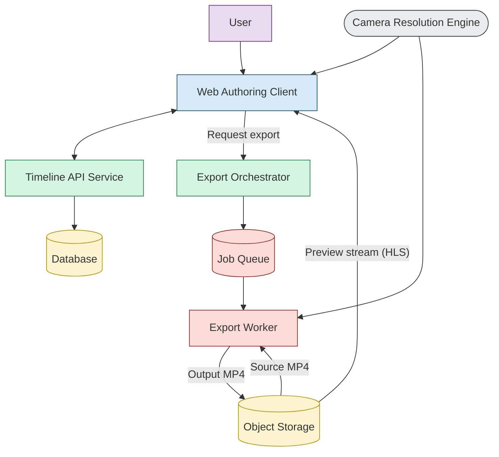

## 1. Problem Context

- Extract focused clips from long, high resolution panoramic or wide angle sports videos.
- This tool is intended to help analysts manually generate reframed clips until AI models are ready
- Analyst selects a clip, adjust visible framing over time, preview the result, and export an MP4
## 2. Goals
- **Non-destructive editing:** Source video is never modified.
- **Sparse intent persistence:** Store only keyframes + segment transitions (cut/smooth), not continuous gestures.
- **Deterministic playback and export:** Same timeline + same inputs ⇒ same output MP4.
- **Preview ≡ Export geometry:** Preview uses the same camera math as export, via shared logic.
- UI support zoomable timelines, clip navigation and bookmarks
- Use a minimal backend export worker for final MP4 generation. Keep export logic portable so it can later run in a CLI or native helper if required.

### 2.1 Terminology
| User-facing concept | Internal concept      | Purpose                     |
| ------------------- | --------------------- | --------------------------- |
| Source Video        | Source Video          | Immutable original video    |
| Clip                | Export Range          | Time span to reframe/export |
| Framing Box         | Viewport / sourceRect | Visible crop region         |
| Adjustment Point    | Keyframe              | Saved framing at a time     |
| Smooth Movement     | Smooth transition     | Interpolated movement       |
| Jump                | Cut transition        | Instant view change         |
| Reframed Preview    | CRE-resolved preview  | Output preview              |
| Exported Clip       | Output Video          | Final MP4                   |

## 3. Operating Modes

Video is operated in 2 modes
1. **Edit**
	- Gestures update live preview state only and are not persisted
	- Keyframes are captured at gesture boundaries
2. **Preview**
	- Read only visualization of the edited video
	
- In all the above modes, the system derives the viewport at every frame based on the previous persisted keyframe and segment transition type. This resolution logic is implemented in the **Camera Resolution Engine (CRE)**, a shared library reused consistently across Authoring, Preview, and Export.

## 4. Architecture




| Component                | Type            | Primary Responsibility                                             |
| ------------------------ | --------------- | ------------------------------------------------------------------ |
| Web Authoring Client     | Browser app     | Author timeline (PTZ, BBox), preview camera intent, request export |
| Camera Resolution Engine | Shared library  | Resolve `sourceRect` at frame time                                 |
| Timeline API Service     | Backend service | Persist timelines (keyframes + ranges), validate invariants        |
| Export Orchestrator      | Backend service | Create export jobs, manage status, serve download URL              |
| Job Queue                | Infra           | Buffer export jobs, enable retries                                 |
| Export Worker (FFmpeg)   | Compute worker  | Deterministically render output                                    |
| Object Storage           | Infra           | Store mezzanine, timelines, outputs                                |

### 4.1 Camera Resolution Engine

**Inputs**
- Ordered keyframes
- Video metadata (width, height, fps, duration)
- Evaluation time t
**Output**
`sourceRect (x, y, w, h)` in source pixels

#### 4.1.1 CRE Calculation
For a frame at time `t` between keyframes at `t1` and `t2`:
```text
alpha = (t - t1) / (t2 - t1)
```
`alpha` ∈ [0,1] expresses progress through the segment.

##### 1. Smooth transition (Linear Interpolation)

For each camera parameter:
```text
value(t) = start + alpha × (end - start)
```
This is applied independently to `x`, `y`, `width`, and `height`.

**Worked Example**
Keyframes:
```
K1 @ 10s: x = 100
K2 @ 14s: x = 300
```
At `t = 12s`:
```
α = 0.5
x(12) = 100 + 0.5 × (300 − 100) = 200
```

##### 2. Cut Transition

For a cut segment:
```
C(t) = C₁   for t < t₂
C(t) = C₂   for t ≥ t₂
```

**Example**
At `13.99s`, the camera still shows `C₁`; at `14.0s`, it jumps to `C₂`.

### 4.2 Preview loop

For each playback time `t`:
1. Invoke the Camera Resolution Engine
2. Resolve the current `sourceRect`
3. Apply the corresponding visual transform to the preview video
### 4.3 Export worker

**Inputs**
- Source MP4 video
- Persisted keyframes and segments
- Video metadata

**Processing Loop**
1. For each output frame time `t`, invoke the Camera Resolution Engine
2. Resolve the `sourceRect`
3. Apply crop and scale operations
4. Encode the frame using FFmpeg

**Output**
- Deterministic MP4 video written to object storage

## 5. Components

| Component                | Type                 | Primary Responsibility                    |
| ------------------------ | -------------------- | ----------------------------------------- |
| Web Reframing Client     | Browser app          | Clip selection, visual reframing, preview |
| Camera Resolution Engine | Shared library       | Resolve `sourceRect` at frame time        |
| Clip API                 | Backend service      | Persist clips, keyframes, segments        |
| Export API               | Backend service      | Create export jobs                        |
| Job Queue                | Infra                | Buffer jobs and retries                   |
| Export Core              | Shared export module | CRE + FFmpeg orchestration                |
| Export Worker            | Compute worker       | Render final MP4                          |
| Object Storage           | Infra                | Store source and output videos            |
| Database                 | Storage              | Store metadata and clip state             |

## 5. Data model

## 6. APIs

## 7. Azure architecture

POCs
wasm for CRE
wasm vs react for frontend


